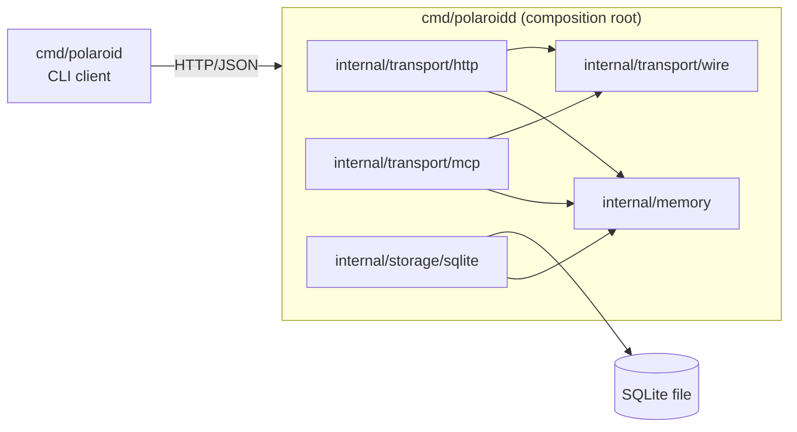

# Architecture overview

Polaroid stores procedures that agents find, follow, and correct. It manages generic records, versions, and (later) relationships and evidence. It never runs an LLM and never executes instructions: agents do that with their own tools. Task knowledge lives in record content; adding a task never changes code.

This page describes what is **implemented**: procedure identity and immutable versions (increment 1); repository bindings, named subprocedure references and the bounded composition graph (increment 2); and immutable execution records with child-execution links, derived context-specific verification and evidence-based contextual resolution ([#7](https://github.com/ashuangiras/polaroid/issues/7), [#9](https://github.com/ashuangiras/polaroid/issues/9), [#11](https://github.com/ashuangiras/polaroid/issues/11), [#13](https://github.com/ashuangiras/polaroid/issues/13), increment 3); and the MCP transport and immutable feedback reports about Polaroid itself ([#15](https://github.com/ashuangiras/polaroid/issues/15), [#16](https://github.com/ashuangiras/polaroid/issues/16), increment 4). Planned components are listed at the end and in the [roadmap](../development/roadmap.md).

## Components and dependency direction

One Go module, one repository. Dependencies point inward to the domain:

| Component | Contract | Depends on |
| --- | --- | --- |
| `internal/memory` | Record types, validation, version rules, `Service`, and the `Store` interface it needs | Standard library only (`uuid`, `encoding/json/jsontext`) |
| `internal/storage/sqlite` | Implements `memory.Store`: atomic writes, canonical-key and binding-name uniqueness, immutability, migrations | `memory`, `database/sql`, `modernc.org/sqlite` |
| `internal/transport/http` | The [HTTP API](http-api.md): parsing, JSON-shape checks, error mapping, security checks | `memory`, `wire`, `net/http` |
| `internal/transport/mcp` | The [MCP server](mcp.md) at `/mcp`: tools, resources, strict argument decoding | `memory`, `wire`, the MCP Go SDK |
| `internal/transport/wire` | Record and error JSON shapes, strict decoding and error classification, shared by both transports so they cannot drift | `memory` |
| `cmd/polaroidd` | Configuration, wiring, listener, timeouts, graceful shutdown | all of the above |
| `cmd/polaroid` | Generic CLI over the HTTP API | Standard library only |

Each internal package is tested on its own against its contract: validation rules in `memory`, persistence and concurrency in `storage/sqlite` (real database files), and the full stack through real HTTP in `transport/http` and `transport/mcp` (the latter through the SDK's own client). `internal/archtest` fails the build if `memory` imports HTTP, SQL or storage code, if storage imports transport, if a transport imports storage, or if the two transports import each other.

There is deliberately one interface (`memory.Store`): it lets the domain stay ignorant of SQLite. No other abstraction exists until a second implementation or a test needs one.

## Request flow

1. `polaroidd` accepts a request; the server enforces header/read/write timeouts.
2. `transport/http` applies the loopback-host check (when bound to loopback) and cross-origin protection, decodes the body strictly (1 MiB limit, unknown or duplicate members rejected), and calls `memory.Service`. Requests to `/mcp` pass the same checks, and `transport/mcp` decodes tool arguments with the same strict rules.
3. `memory.Service` validates the envelope, assigns IDs, version numbers and timestamps, and calls the `Store`.
4. `storage/sqlite` performs the write in one transaction, or the read in one statement.
5. Domain errors map to `400`/`404`/`409`; anything else is logged and returned as `500 internal` without detail.

## Consistency and concurrency

- **Writes** run in one transaction that takes SQLite's write lock at `BEGIN` (`_txlock=immediate`, `busy_timeout` 5s). Concurrent writers queue; none fails mid-transaction.
- **Revisions** carry the base version they were derived from. The store checks "base equals latest" and inserts `latest + 1` inside that transaction, so of N concurrent revisions from one base exactly one succeeds and the rest get `409 version_conflict`. Nothing is merged or overwritten. Binding revisions follow the same rule with `base_revision` and `409 revision_conflict`.
- **Reads** are single SQL statements, so a history is always one consistent snapshot (WAL mode lets reads proceed during writes). The composition graph, verification and resolution need one query per node, so they read inside one transaction instead.
- **Integrity backstops in the schema**: unique canonical keys, `(repository, name)` pairs and repository identifiers; triggers reject any `UPDATE` or `DELETE` of procedures, versions, bindings, binding revisions, executions and their child links, feedback reports, repositories, repository identifiers and procedure origins, any non-contiguous version or revision number, a pin to a version that does not exist, an execution that does not match its binding revision, and a child link that does not fulfil its reference; a reference row can be written only in the same transaction as its new version (a trigger plus a deferred foreign key); `CHECK` constraints require `contract`, `instructions` and `inputs` to be JSON objects and keep identifiers in their canonical formats. These hold even for a client that bypasses `polaroidd`.
- **Durability**: `synchronous=FULL`. Schema migrations run in a write transaction at startup; a database newer than the binary is refused.

## Security posture

There is no authentication or authorization yet ([ADR-0006](decisions/0006-local-unauthenticated-api.md)). The daemon listens on `127.0.0.1:7417` by default, and then:

- rejects requests whose `Host` is not a loopback name (blocks DNS rebinding from web pages);
- rejects unsafe cross-origin browser requests (`net/http.CrossOriginProtection`);
- requires `Content-Type: application/json` on writes and limits bodies to 1 MiB;
- never returns internal error text.

Binding to a non-loopback address is possible (`-addr`) but logs a warning: anyone who can reach the port can read and write records. Access control is planned.

## Planned components (not implemented)

No planned component is scoped yet. See the [roadmap](../development/roadmap.md).
