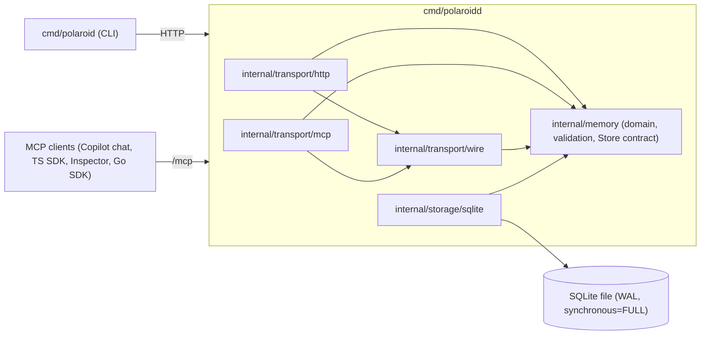

# Polaroid: project review, 2026-10-09

This document describes the project as it stands at `main` = `4aba74c` (the code baseline), for review by a third party. The change that adds this review also commits the end-to-end scripts and closes two documentation gaps (§9, items 4 and 8); it does not change any Go code. It covers:
- what was built;
- how it is structured;
- how it was verified;
- how the work was governed;
- what is missing or risky.

Every quantitative claim has a command that reproduces it (see [How to verify this review](#11-how-to-verify-this-review)). The repository is private: [ashuangiras/polaroid](https://github.com/ashuangiras/polaroid).

## 1. Summary

**What Polaroid is.** A versioned procedural memory service for AI agents:
- written in Go 1.27, with SQLite storage;
- served as a JSON HTTP API, an MCP server and a CLI.

Agents find a procedure, follow its instructions, record what ran with evidence, and append corrected versions. Polaroid stores and relates these records but never interprets the instructions. Task knowledge lives in records, never in code.

**Delivered.** Four roadmap increments, plus three items that came from agent feedback.

| | Count |
| --- | --- |
| Commits on `main` (all 2026-10-09) | 26 |
| GitHub issues closed | 12, none open |
| PRs merged | 13 |
| Architecture decision records | 16 |
| SQLite migrations | 6 |

**Surfaces.**

| | Count |
| --- | --- |
| HTTP routes, including `/healthz` | 22 |
| MCP tools | 20 |
| MCP resource templates | 3 |
| CLI commands | 22 |

**Verification.**
- **Tests:** 150 top-level test functions, plus 229 subtests. They run against real SQLite files and real HTTP, with no mocks of persistence and no sleeps for synchronization.
- **The `make ci` gate:** format, vet, golangci-lint 2.14.0, build, tests, the race detector, a dependency and license gate, govulncheck and a live demo.
- **CI history:** all 28 recorded GitHub Actions runs succeeded.
- **Negative checks:** 41 are recorded in [status.md](status.md). Each mutation broke a rule on purpose and showed that a test failed.

**Main gaps** (details in [§9](#9-known-gaps-risks-and-limitations)):
- no project license;
- no authentication, so it is loopback only by design;
- unbounded lists;
- `make demo` does not exercise the newer features, and the end-to-end scripts are not in CI;
- the work has had no independent human code review.

## 2. Timeline and delivered work

All work happened on 2026-10-09. An AI coding agent did it, directed by the repository owner. Every item followed the same pattern:
1. a GitHub issue with acceptance criteria;
2. an ADR for consequential choices, as its own commit;
3. an implementation commit with tests and documentation;
4. a PR, CI, a rebase merge, and a handoff in [status.md](status.md).

| Increment | Issue | PR | ADR | Delivered |
| --- | --- | --- | --- | --- |
| 1 | — | — | 0001–0006 | Procedure identity (UUIDv7, unique canonical key), immutable versions, optimistic concurrency with `base_version`, SQLite, HTTP API, CLI |
| 2 | #1 | #4 | 0007 | Repository bindings with guarded revisions |
| 2 | #2 | #5 | 0008 | Named subprocedure references in versions |
| 2 | #3 | #6 | 0009 | Cycle rejection; bounded composition graph (depth 32, 2048 nodes) |
| 3 | #7 | #8 | 0010 | Immutable execution records (version, repository, full commit, environment, inputs, outcome, evidence) |
| 3 | #9 | #10 | 0011 | Parent executions link child executions |
| 3 | #11 | #12 | 0012 | Verification derived on read, per combination |
| 3 | #13 | #14 | 0013 | Contextual references resolved from verification evidence |
| 4 | #15 | #17 | 0014 | MCP server at `/mcp`: 17 tools, full parity with the HTTP API |
| 4 | — | #18 | — | VS Code `.vscode/mcp.json` committed |
| 4 | #16 | #19 | 0015 | Feedback box: agents report problems and suggestions about Polaroid |
| Feedback | #22 | #23 | — | Docs: member order is kept as received; clients may reorder |
| Feedback | #20 | #24 | — | MCP list results pinned `ttlMs: 0`; client-restart guidance (re-scoped, see §8) |
| Feedback | #21 | #25 | 0016 | `/mcp` also accepts protocol 2025-11-25, without sessions |

## 3. Architecture



- **Domain:** `internal/memory` holds records, validation, the version and resolution rules, and the `Store` interface. It does not import HTTP, SQL or storage. `internal/archtest` enforces that.
- **Transports:** both call the domain service directly. They share record shapes, strict decoding and error classification through `internal/transport/wire`, so they cannot drift apart. Neither imports the other.
- **Storage:** every write is one transaction. Immutability is enforced twice: by the service, and by schema triggers and `CHECK` constraints. The schema also rejects bad writes from clients that bypass the daemon.
- **Daemon:** `polaroidd` listens on loopback by default, behind a loopback `Host` check and cross-origin protection ([ADR-0006](../architecture/decisions/0006-local-unauthenticated-api.md)).

| Package | Production lines | Lines incl. tests | Test functions |
| --- | ---: | ---: | ---: |
| `internal/memory` | 1679 | 2794 | 41 |
| `internal/storage/sqlite` | 930 | 2549 | 45 |
| `internal/transport/http` | 590 | 2707 | 43 |
| `internal/transport/wire` | 673 | 673 | 0 |
| `internal/transport/mcp` | 399 | 884 | 9 |
| `cmd/polaroid` | 289 | 628 | 7 |
| `cmd/polaroidd` | 149 | 319 | 4 |
| `internal/archtest` | 3 | 70 | 1 |
| **Total** | **4712** | **10624** | **150** |

Counts are non-blank lines of Go source.

## 4. Contracts

The contracts are maintained as documents and updated in the same change as the code:

| Contract | Document |
| --- | --- |
| Records, identity and versioning | [records.md](../architecture/records.md) |
| HTTP API: 22 routes, errors, limits | [http-api.md](../architecture/http-api.md) |
| MCP server: 20 tools, 3 resources, protocol and caching | [mcp.md](../architecture/mcp.md) |
| Package boundaries | [overview.md](../architecture/overview.md) |

**Invariants across all surfaces:**
- **Strict decoding:** unknown or duplicate members are rejected, and so is trailing data. Free-form objects (`contract`, `instructions`, `inputs`, `evidence`, `context`) keep their member order as received and are never interpreted.
- **Immutable history:** stored versions, binding revisions, executions, child links and feedback reports cannot be updated or deleted, even through raw SQL.
- **Explicit conflicts:** a revision names its base. A stale base is `409 version_conflict` or `409 revision_conflict`, never a merge.
- **Errors:** stable error codes. Internal errors are logged and returned only as `internal`.
- **Change policy:** API changes are additive within `/v1`. Schema changes are new migrations, and applied migrations are never edited.

## 5. Key decisions

All 16 ADRs are in [docs/architecture/decisions](../architecture/decisions/README.md). The ones that shape the product most:

- **ADR-0004.** Append-only versions guarded by an expected base version.
- **ADR-0006.** The API is loopback-only and unauthenticated until access control exists.
- **ADR-0010 to ADR-0013.** Executions:
  - executions are immutable after-the-fact records;
  - verification is *derived* on every read, never stored;
  - a combination's latest execution decides its status;
  - contextual references resolve from verified evidence in a repository and environment.
- **ADR-0014.** MCP over stateless streamable HTTP, with flat tool arguments and the HTTP record shapes.
- **ADR-0015.** Feedback reports are immutable and have no triage state; triage happens outside, as GitHub issues.
- **ADR-0016.** The protocol clause of ADR-0014 is superseded: 2025-11-25 is accepted too, still without sessions.

## 6. Quality and verification

| Gate | What it checks | Where it runs |
| --- | --- | --- |
| `make check` | gofmt, go vet, golangci-lint 2.14.0, build, `go test`, `go test -race`, dependency and license inventory (18 modules, all permissive) | Locally, and in CI |
| `make vuln` | govulncheck | CI, and locally with network |
| `make demo` | Live daemon: create, revise, conflict, two-repository binding, execution, restart persistence | CI, and locally |
| GitHub Actions `ci` | `make ci` on ubuntu-latest with Go from `go.mod` | Every PR and every push to `main`; 28 runs, all successful |

**Testing approach:**
- **Real dependencies:** real SQLite files (`t.TempDir()`) and real HTTP (`httptest`). MCP tests use the official Go SDK client, and some send raw JSON-RPC to assert the exact bytes on the wire.
- **Concurrency:** conflict paths are tested with parallel writers. Exactly one of several concurrent revisions from the same base succeeds.
- **Schema backstops:** tests write invalid rows and attempt updates and deletes through raw SQL, bypassing the store. Each attempt must be rejected.
- **Negative checks (mutations):** for each feature, rules were broken on purpose and the expected tests had to fail. The 41 entries in [status.md](status.md#verification-evidence) name the failing tests. Three times, this process exposed a test that passed for the wrong reason or did not discriminate, and the test was fixed: the child-link schema test, the evidence-ordering test and the verified-child-tree test.
- **Live interop:** VS Code Copilot chat, TypeScript SDK 1.32.1, MCP Inspector 2.10.1 and the Go SDK were each run against a live daemon. All four work.

**End-to-end scripts:** `make e2e` (`scripts/e2e.sh`, 197 checks) and `make e2e-mcp` (`scripts/e2e-mcp.sh`, 86 checks). Each writes a report of every command, its real output and each check to `bin/e2e/`. Both pass. Checks that need an optional tool (npm for the TypeScript SDK and MCP Inspector, or a macOS VS Code install) are reported as skipped when it is missing, never as passed. The scripts are not part of `make ci`.

## 7. Process and governance

- **The rule set:** [AGENTS.md](../../AGENTS.md). Its main rules:
  - task knowledge lives in records, never in code;
  - history is immutable;
  - domain-package boundaries are kept;
  - only what is built gets implemented;
  - internal errors are never exposed;
  - dependencies are rare, permissive and pinned.
- **Issues are the source of truth for scope** ([roadmap.md](roadmap.md) holds order and links).
- **Decisions before code:** an ADR precedes each consequential change.
- **Handoffs:** each PR body states the behavior change, compatibility, the acceptance criteria with the test that proves each one, evidence, and what was not run. [status.md](status.md) is replaced at every handoff.
- **Merges:** rebase merges keep a linear history. ADR commits are separate from implementation commits.

## 8. The agent feedback loop, end to end

The last part of the work shows the product's own premise: agents improving the system they use.

1. **The feedback box (#16).** The MCP server's instructions ask agents to report problems and suggestions with `report_feedback`.
2. **Three real reports.** An agent (Copilot chat in this repository) recorded them about friction it actually met:
   - the TypeScript SDK and MCP Inspector are refused;
   - VS Code kept a stale tool list after an upgrade;
   - the client reorders object members.
3. **Triage into issues.** The reports were fetched with `list_feedback` and filed as issues #20–#22, each citing its report ID.
4. **Research before code changed two of them:**
   - **#20 was re-scoped.** Polaroid already sent the protocol's cache hint, `ttlMs: 0`. Inspection of the VS Code bundle showed that VS Code ignores it and reads `serverInfo.version` only for telemetry, so the proposed version hash would not have helped. The owner chose to pin `ttlMs: 0` with a test and document the client restart instead. The issue carries a comment explaining this.
   - **#21's criterion 3 was corrected.** The MCP lifecycle forces a counter-offer on an older `initialize`, so "refused" became "never served below 2025-11-25", with a test.

## 9. Known gaps, risks and limitations

| # | Item | Impact | Status |
| --- | --- | --- | --- |
| 1 | **No project license** (`LICENSE` absent). | The code is all rights reserved, which blocks external use and contribution. | Deferred by the owner. |
| 2 | **No authentication or authorization.** | Anyone who can reach the port can read and write. This is mitigated by loopback-only listening, the `Host` check and cross-origin protection. Reporters and record authors are self-asserted. | By design until access control exists (ADR-0006, roadmap "Later"). |
| 3 | **Unbounded lists, no pagination.** | Large stores produce large responses. Feedback reports also accumulate without limit, deduplication or rate limiting. | Planned as opt-in pagination. |
| 4 | **The end-to-end scripts were not committed** (they lived in the gitignored `bin/`). | Reviewers and CI could not rerun the 283 end-to-end checks or the interop checks. | **Closed:** committed as `scripts/e2e.sh` and `scripts/e2e-mcp.sh`, with `make e2e` and `make e2e-mcp`. They are still not run in CI, because the full run repeats `make check` and the interop checks need npm. |
| 5 | **`make demo` covers increments 1–2 and basic executions only.** | MCP, feedback, verification and resolution are proven by tests and the end-to-end scripts, but not by the CI demo. | Open: extend the demo, or run `make e2e-mcp` in CI. |
| 6 | **`internal/transport/wire` has no direct tests.** | It is covered only through the HTTP and MCP tests. A shape bug used by only one transport could slip through. | Low risk; consider shape tests. |
| 7 | **No independent human code review.** | An agent wrote all the changes and the owner merged them; PRs have no required reviewers. Quality rests on tests, mutation checks and CI. | This review is the first external look. |
| 8 | **Documentation lagged in two places:** [roadmap.md](roadmap.md) did not list #20–#22, and the CI-evidence rows in [status.md](status.md) stopped at PR #14. | Traceability gaps only. The GitHub run history is complete. | **Closed:** the roadmap lists them, and status.md records every PR and `main` run through `4aba74c`. |
| 9 | **Client caching.** VS Code keeps a stale tool list despite `ttlMs: 0`. | After an upgrade, users must run "MCP: Restart Server". | Documented in [mcp.md](../architecture/mcp.md); cannot be fixed server-side. |
| 10 | **Two MCP protocol revisions** (2026-07-28 and 2025-11-25). | More surface to keep working. Clients older than 2025-11-25 receive a counter-offer rather than a hard refusal. | Accepted in ADR-0016, with no planned removal. |
| 11 | **No performance data.** | SQLite with a single writer; no benchmarks or load tests. The graph limits (32 deep, 2048 nodes) are the only scale guards. | Not yet scoped. |
| 12 | **Local lint mismatch.** The machine has golangci-lint 2.12.2, and 2.14.0 is pinned. | Local runs need `GOLANGCI_LINT=<path>`. CI is unaffected. | Deferred by the owner. |
| 13 | **The import from the earlier PoC is blocked.** | No source database or schema is available, so no compatibility is claimed. | Blocked on input. |

## 10. Corrections made during the work

These are recorded for transparency:
- A stray file deletion was staged into an ADR commit. It was split out with a soft reset before the push, so no published history was rewritten.
- An early conclusion that VS Code could not connect came from inspecting the wrong bundle. A live test in Copilot chat disproved it, and the documentation states the verified result.
- A static-analysis finding (QF1008, embedded-field selectors) was fixed rather than suppressed.
- #20 and #21 were adjusted after research, as described in §8. Both adjustments are explained on the issue or PR.

## 11. How to verify this review

The commands assume a checkout of `main`, Go 1.27.2, golangci-lint 2.14.0, bash 4 or newer, `jq` and `sqlite3`. npm is optional.

```sh
make ci GOLANGCI_LINT=/path/to/golangci-lint-2.14.0   # check + vuln + demo
make e2e GOLANGCI_LINT=/path/to/golangci-lint-2.14.0  # 197 checks, report in bin/e2e/REPORT.md
make e2e-mcp                                          # 86 checks (82 without npm), bin/e2e/MCP-REPORT.md
go test -count=1 -v ./... | grep -c '^--- PASS'        # 150
ls docs/architecture/decisions/0*.md | wc -l            # 16
ls internal/storage/sqlite/migrations                   # 0001 to 0006
gh issue list --state all; gh pr list --state all       # issues and PRs listed in §2
gh run list --limit 60                                  # every run successful
```

The commit, PR and run counts in §1 were taken at `4aba74c`. The change that adds this review adds two commits and one PR.

To check the immutability claims, run the schema tests, for example `go test ./internal/storage/sqlite -run Schema -v`. To check the MCP claims, run `go test ./internal/transport/mcp -v`.

## 12. Suggested focus for the reviewer

1. **Security model** (ADR-0006, §9 item 2): is loopback-only plus the `Host` check and cross-origin protection adequate for the intended local use?
2. **Data model and immutability:** check the triggers in `internal/storage/sqlite/migrations/` against [records.md](../architecture/records.md).
3. **The verification and resolution semantics** (ADR-0012, ADR-0013): are they correct, and are they understandable for agents?
4. **MCP compatibility** (ADR-0014, ADR-0016): two protocol revisions, and the counter-offer behavior for older clients.
5. **Gaps 5 and 6 in §9:** cheap to close before wider use.
